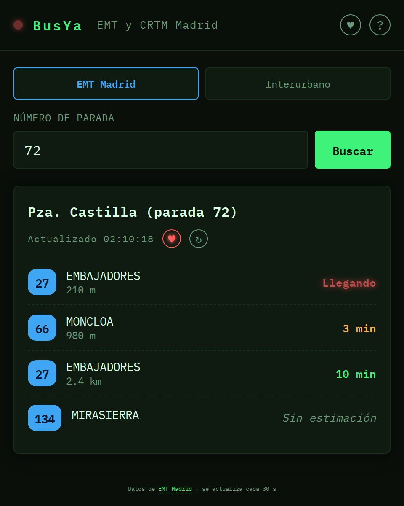

# BusYa


Tiempos de paso en tiempo real de los buses urbanos de EMT Madrid y los interurbanos de la
Comunidad de Madrid (CRTM) para una parada dada, con favoritos y funcionando como PWA
instalable en el móvil.

Segundo proyecto de una serie de apps con APIs públicas para portfolio, junto a
[Disaster Watch](https://github.com/rzazo24/disaster-watch) con GDACS (un intento previo de
tracker de vuelos vía OpenSky se descartó por restricciones de la API antes de llegar a nada
publicable).



## Stack

- Vanilla HTML/CSS/JS, sin frameworks ni build step.
- Desplegado en Vercel como sitio estático + Vercel Functions mínimas que actúan de proxy
  hacia cada API de transporte.

### EMT Madrid

La API de EMT ([openapi.emtmadrid.es](https://openapi.emtmadrid.es)) requiere login con
email/password para obtener un `accessToken` (válido ~1 hora), así que no se puede consumir
100% desde el frontend estático sin exponer credenciales — de ahí el proxy.

Cuando una línea no tiene tiempo real fiable (frecuente en líneas nocturnas sin GPS), el
frontend cae a `/api/emt-stop-detail` y muestra la frecuencia de servicio de esa línea
("cada 8-12 min · hasta 23:30") en vez de dejar el hueco vacío. La API de tiempo real de EMT
no da la hora programada de paso por una parada concreta (eso solo está en su feed GTFS
estático); usar el horario/frecuencia por línea evita depender de ese feed.

### Interurbanos (CRTM)

La API de CRTM ([crtm.es/widgets/api](https://www.crtm.es/widgets/api)) es pública y no
requiere credenciales, pero no manda cabeceras CORS — el proxy (`api/crtm-arrives.js`) existe
solo para saltar esa restricción del navegador, no para esconder ningún secreto. Los números
de parada son propios de CRTM (formato `8_{código}`, donde `8` = autobuses interurbanos) y no
tienen relación con la numeración de EMT: un mismo número puede ser una parada distinta en
cada red, por eso el buscador tiene un selector de red. CRTM da la hora absoluta de paso en
vez de segundos restantes (se calcula en el proxy) y no distingue tiempo real de programado
con un sentinel como EMT, así que puede dar esperas de varias horas de madrugada sin que sea
un error. En las dos redes, a partir de 45 min de espera el tiempo se muestra como la hora de
paso (HH:MM) en vez de una cuenta atrás larga.

Las líneas de EMT se muestran en azul y las de Interurbano en verde — el mismo color que
llevan esos autobuses en la calle. La distancia del bus en Interurbano es aproximada (línea
recta entre dos coordenadas GPS, no la ruta real): se calcula con una llamada adicional a
`GetLineLocation.php` por cada línea+sentido que aparece en los resultados, y se marca con
"~" en la interfaz para dejar claro que no es exacta como el `DistanceBus` real de EMT.

## Paradas cercanas

"📍 Buscar paradas cerca de mí" pide permiso de ubicación al navegador y muestra las paradas
de las dos redes a menos de 300 m, ordenadas por distancia, con sus líneas — toca una para ver
sus tiempos. El backend (`api/nearby-stops.js`) reutiliza el propio agregador de CRTM
(`GetNearestStopsByLocation.php`), que también indexa las paradas de EMT: no hace falta un
endpoint de geolocalización propio de EMT, que no lo expone en su API pública.

## Enlace directo a una parada

La URL siempre refleja la parada que se está viendo (`?stop=72&network=emt`), así que se
puede compartir o guardar como marcador y abrirla directamente en esa parada. Un enlace con
`?stop=` manda por delante de la última parada consultada en ese navegador.

## Favoritos

Se guardan solo en `localStorage`, sin cuentas ni servidor — no se sincronizan entre
dispositivos ni sobreviven a borrar los datos del sitio (se explica en el panel de ayuda de
la propia app). Cada favorito recuerda su red (EMT o Interurbano), así que un mismo número de
parada en las dos redes no se confunde. Desde el botón ♥ de la cabecera se abre un panel con
una tarjeta por parada favorita, donde se puede renombrar (input editable), reordenar (↑/↓) y
saltar directamente a sus tiempos de paso.

También se pueden marcar líneas como favoritas tocando su número en la lista de tiempos de
paso: se resaltan con un anillo dorado y suben al principio de la lista de esa parada (como
mucho las 3 próximas llegadas de cada línea, para no tapar el próximo bus real de otra línea
con una llegada lejana de la favorita).

## PWA

Instalable desde el navegador ("Añadir a pantalla de inicio" / el aviso de instalación de
Chrome) y funciona sin conexión gracias a un service worker (`sw.js`) que cachea el shell
estático (HTML/CSS/JS/manifest/iconos) con una estrategia stale-while-revalidate — nunca los
tiempos de paso en sí, que siempre se piden en vivo. Revisa si hay actualización cada vez que
la app vuelve a primer plano, no solo con la frecuencia por defecto del navegador (~24h); al
detectar una versión nueva, avisa con un mensaje y un botón "Recargar" en vez de recargar la
pestaña sola, para no cortar una búsqueda a medias.

## Estructura

```
busya/
├── api/
│   ├── emt-arrives.js       # GET /api/emt-arrives?stopId= — tiempos de paso EMT en tiempo real
│   ├── emt-stop-detail.js   # GET /api/emt-stop-detail?stopId= — horario/frecuencia por línea (EMT)
│   ├── crtm-arrives.js      # GET /api/crtm-arrives?stopId= — tiempos de paso + distancia interurbanos (CRTM)
│   └── nearby-stops.js      # GET /api/nearby-stops?lat=&lon= — paradas EMT+CRTM cercanas a una coordenada
├── lib/
│   ├── emt-client.js        # Login + caché de accessToken, compartido por las dos funciones de EMT
│   └── geo.js                # Distancia entre coordenadas GPS, compartida por crtm-arrives.js y nearby-stops.js
├── css/
│   └── style.css
├── js/
│   └── app.js                # Selector de red, búsqueda, refresco de 30s, favoritos, PWA
├── icons/                    # Iconos de la PWA (192/512/512-maskable/apple-touch-icon)
├── index.html
├── favicon.svg
├── manifest.webmanifest
├── sw.js                     # Service worker: cachea el shell estático, nunca los tiempos de paso
├── screenshot.png
├── .env.example
├── vercel.json
├── LICENSE
└── package.json
```

## Desarrollo local

1. Copia `.env.example` a `.env.local` y rellena tus credenciales de
   [openapi.emtmadrid.es](https://openapi.emtmadrid.es) (email/password de tu cuenta):

   ```
   EMT_EMAIL=tu_email@ejemplo.com
   EMT_PASSWORD=tu_password
   ```

2. Instala el CLI de Vercel si no lo tienes y levanta el entorno local (sirve el estático
   y las funciones de `api/` juntos, tal como en producción):

   ```bash
   npx vercel dev
   ```

3. Abre `http://localhost:3000`, elige la red (EMT o Interurbano) e introduce un número de
   parada para consultar los tiempos de paso.

## Despliegue en Vercel

1. `npx vercel link` (o importa el repo desde el dashboard de Vercel).
2. Configura las variables de entorno en el proyecto de Vercel (Settings → Environment Variables):
   - `EMT_EMAIL`
   - `EMT_PASSWORD`
3. `npx vercel --prod`.

No hace falta ningún paso de build: Vercel sirve `index.html`/`css`/`js` como estático y
despliega cada archivo de `api/` como Function automáticamente.

## Licencia

Código bajo licencia MIT (ver [LICENSE](LICENSE)). Los datos de EMT Madrid y de CRTM se rigen
por los términos de uso de sus respectivas APIs, enlazadas más arriba.
